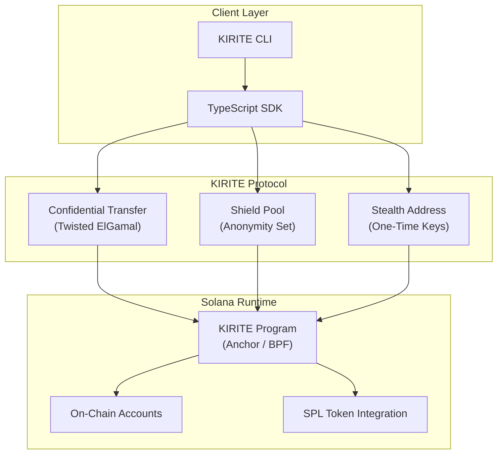

<p align="center">
  
</p>

<h3 align="center">
  <code>the signature exists. the hand does not.</code>
</h3>

<p align="center">
  <a href="https://github.com/kirite-protocol/kirite/actions"></a>
  <a href="./LICENSE"></a>
  <a href="https://solana.com"></a>
  <a href="https://www.rust-lang.org"></a>
  <a href="https://www.typescriptlang.org"></a>
  <a href="https://colosseum.com"></a>
</p>

---

## What is KIRITE?

**KIRITE** (切手 / きりて) is a privacy payment layer for Solana that makes transaction amounts invisible, sender-receiver links untraceable, and recipient addresses unlinkable.

Solana is fast. Solana is cheap. Solana is also a public ledger where every transfer, every amount, every wallet interaction is permanently visible to anyone with an explorer. KIRITE changes that. It introduces protocol-level privacy primitives that integrate directly with the Solana runtime, requiring no off-chain relayers, no trusted setup ceremonies, and no modifications to the base layer.

Three cryptographic layers work in concert:

- **Confidential Transfer** encrypts transfer amounts using Twisted ElGamal encryption, so only the sender and receiver know how much was moved.
- **Shield Pool** severs the on-chain link between sender and receiver through anonymity pools with cryptographic commitments.
- **Stealth Address** generates one-time recipient addresses, making it impossible to associate multiple payments to the same party.

Each layer is independent and composable. Use one, two, or all three depending on your privacy requirements.

---

## Architecture



**Confidential Transfer** sits closest to the token layer, wrapping SPL token operations with homomorphic encryption. **Shield Pool** operates above, pooling deposits and withdrawals to break transaction graph analysis. **Stealth Address** provides the outermost privacy layer, ensuring recipients cannot be identified even by observers who monitor pool activity.

---

## Installation

```bash
git clone https://github.com/kirite-protocol/kirite.git
cd kirite
```

---

## Quick Start

### TypeScript SDK

```typescript
import { KiriteClient, ShieldPool, StealthAddress } from "@kirite/sdk";
import { Connection, Keypair } from "@solana/web3.js";

// Initialize client
const connection = new Connection("https://api.mainnet-beta.solana.com");
const wallet = Keypair.fromSecretKey(/* your key */);
const kirite = new KiriteClient(connection, wallet);

// 1. Confidential Transfer — encrypt the amount
const tx = await kirite.confidentialTransfer({
  mint: TOKEN_MINT,
  recipient: recipientPublicKey,
  amount: 1000_000, // in lamports / smallest unit
});
console.log("Confidential transfer:", tx.signature);

// 2. Shield Pool — deposit into anonymity pool
const pool = new ShieldPool(kirite);
const depositNote = await pool.deposit({
  mint: TOKEN_MINT,
  amount: 1_000_000,
});
// Save depositNote.commitment — required for withdrawal
console.log("Deposit commitment:", depositNote.commitment);

// 3. Shield Pool — withdraw to a different wallet
const withdrawTx = await pool.withdraw({
  commitment: depositNote.commitment,
  nullifier: depositNote.nullifier,
  recipient: newWalletPublicKey,
});

// 4. Stealth Address — generate a one-time address for receiving
const stealth = new StealthAddress(kirite);
const { address, ephemeralPubkey } = stealth.generate(recipientSpendKey);
console.log("Send funds to stealth address:", address.toBase58());

// 5. Stealth Address — scan and recover funds
const found = await stealth.scan(mySpendKey, myViewKey);
for (const utxo of found) {
  await stealth.claim(utxo);
}
```

---

## SDK API Reference

### `KiriteClient`

| Method | Description |
|---|---|
| `confidentialTransfer(params)` | Encrypt and send tokens with hidden amounts |
| `getConfidentialBalance(mint, owner)` | Decrypt and return the confidential balance |
| `initializeConfidentialAccount(mint)` | Set up a confidential token account |

### `ShieldPool`

| Method | Description |
|---|---|
| `deposit(params)` | Deposit tokens into the anonymity pool |
| `withdraw(params)` | Withdraw tokens using a commitment proof |
| `getPoolInfo(mint)` | Query pool state and anonymity set size |

### `StealthAddress`

| Method | Description |
|---|---|
| `generate(recipientSpendKey)` | Create a one-time stealth address |
| `scan(spendKey, viewKey)` | Scan the chain for stealth payments |
| `claim(utxo)` | Claim funds sent to a stealth address |

---

## CLI Usage

```bash
# Initialize a confidential account
kirite init --mint <MINT_ADDRESS>

# Confidential transfer
kirite transfer --mint <MINT_ADDRESS> --to <RECIPIENT> --amount 100

# Deposit into shield pool
kirite pool deposit --mint <MINT_ADDRESS> --amount 50

# Withdraw from shield pool
kirite pool withdraw --commitment <COMMITMENT> --to <RECIPIENT>

# Generate a stealth address
kirite stealth generate --spend-key <SPEND_KEY>

# Scan for stealth payments
kirite stealth scan --spend-key <SPEND_KEY> --view-key <VIEW_KEY>

# Check confidential balance
kirite balance --mint <MINT_ADDRESS>
```

---

## Project Structure

```
kirite/
  programs/
    kirite/              # Anchor on-chain program
      src/
        instructions/    # Program instruction handlers
        state/           # Account structures
        crypto/          # Twisted ElGamal, commitment schemes
        lib.rs
  sdk/                   # TypeScript SDK
    src/
      client.ts
      shield-pool.ts
      stealth-address.ts
      crypto/
  cli/                   # Rust CLI
    src/
      main.rs
      commands/
  docs/                  # Architecture & protocol specs
  tests/                 # Integration tests
```

---

## Security

KIRITE handles private financial data. If you discover a vulnerability, please follow our [responsible disclosure process](./SECURITY.md). Do not open public issues for security bugs.

---

## Contributing

See [CONTRIBUTING.md](./CONTRIBUTING.md) for development setup, code style, and PR guidelines.

---

## License

[MIT](./LICENSE) -- Copyright 2025-2026 KIRITE Contributors

---

<p align="center">
  <a href="TWITTER_URL">Twitter</a> · <a href="WEBSITE_URL">Website</a> · <a href="./docs/architecture.md">Docs</a>
</p>

<p align="center">
  <sub>署名は存在する。しかし、その手は誰にも見えない。</sub>
</p>
